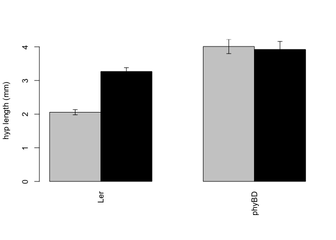
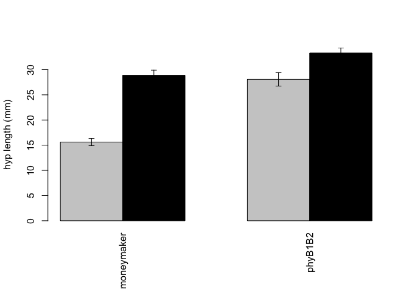
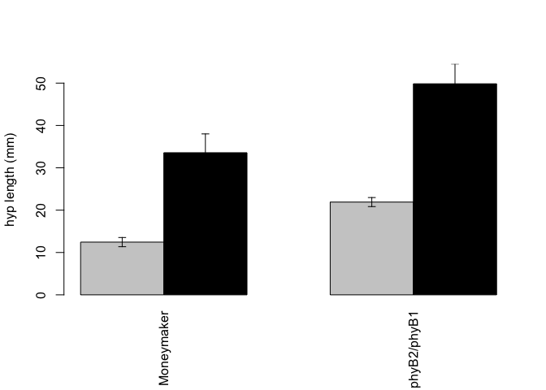
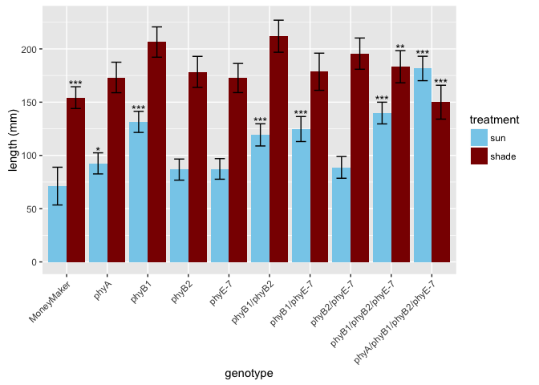

# phyE mutant analysis
Julin Maloof  
August 10, 2015; updated July 11-18, 2016  


```r
library(ggplot2)
```

```
## Warning: package 'ggplot2' was built under R version 3.2.4
```

```r
library(lme4)
```

```
## Loading required package: Matrix
```

```r
library(lmerTest)
```

```
## 
## Attaching package: 'lmerTest'
```

```
## The following object is masked from 'package:lme4':
## 
##     lmer
```

```
## The following object is masked from 'package:stats':
## 
##     step
```

```r
library(multcomp)
```

```
## Loading required package: mvtnorm
```

```
## Loading required package: survival
```

```
## Loading required package: TH.data
```

```
## Loading required package: MASS
```

```
## 
## Attaching package: 'TH.data'
```

```
## The following object is masked from 'package:MASS':
## 
##     geyser
```


# Figure 2

```r
fig2ab <- read.csv("Fig2AB_hyps.csv")

summary(fig2ab)
```

```
##        X                genotype     light          rep       
##  Min.   :  44.0   Ler       :107   shade:160   Min.   :1.000  
##  1st Qu.: 348.2   moneymaker: 75   sun  :158   1st Qu.:1.000  
##  Median : 669.5   phyB1B2   : 74               Median :2.000  
##  Mean   : 637.0   phyBD     : 62               Mean   :1.981  
##  3rd Qu.: 995.8                                3rd Qu.:3.000  
##  Max.   :1159.0                                Max.   :3.000  
##      plant            length              species   
##  Min.   : 1.000   Min.   : 0.593   Arabidopsis:169  
##  1st Qu.: 3.000   1st Qu.: 2.802   S.lyc      :149  
##  Median : 6.000   Median : 5.016                    
##  Mean   : 6.758   Mean   :14.227                    
##  3rd Qu.: 9.000   3rd Qu.:26.236                    
##  Max.   :23.000   Max.   :46.100
```

```r
fig2ab$light <- relevel(fig2ab$light,ref="sun")

table(fig2ab$rep,fig2ab$genotype)
```

```
##    
##     Ler moneymaker phyB1B2 phyBD
##   1  35         27      28    20
##   2  37         21      26    20
##   3  35         27      20    22
```

```r
sem <- function(x,na.rm=T) {
  if(na.rm) x <- na.omit(x)
  sd(x) / sqrt(length(x))
}
```

## Figure 2A

```r
fig2a <- droplevels(fig2ab[grep("Arabidopsis",fig2ab$species),])
levels(fig2a$genotype)
```

```
## [1] "Ler"   "phyBD"
```

```r
fig2a.mean <- with(fig2a,tapply(length,list(light,genotype),mean,na.rm=T))
fig2a.mean
```

```
##            Ler    phyBD
## sun   2.056328 4.010517
## shade 3.267739 3.922000
```

```r
fig2a.sem <- with(fig2a,tapply(length,list(light,genotype),mean,na.rm=T))
fig2a.sem <- with(fig2a,tapply(length,list(light,genotype),sem))

par(las=3,mar=c(6, 4, 4, 2) + 0.1)
x <- barplot(fig2a.mean,beside=T,col=c("grey80","black"),ylim=c(0,max(fig2a.mean+fig2a.sem)),ylab="hyp length (mm)")
arrows(x,fig2a.mean+fig2a.sem,x,fig2a.mean-fig2a.sem,code=3,angle=90,length=.05)
```

<!-- -->

## Figure 2B

```r
fig2b <- droplevels(fig2ab[grep("S.lyc",fig2ab$species,fixed=T),])
levels(fig2b$genotype)
```

```
## [1] "moneymaker" "phyB1B2"
```

```r
fig2b.mean <- with(fig2b,tapply(length,list(light,genotype),mean,na.rm=T))
fig2b.mean
```

```
##       moneymaker  phyB1B2
## sun     15.62318 28.07712
## shade   28.88561 33.31142
```

```r
fig2b.sem <- with(fig2b,tapply(length,list(light,genotype),mean,na.rm=T))
fig2b.sem <- with(fig2b,tapply(length,list(light,genotype),sem))

par(las=3,mar=c(6, 4, 4, 2) + 0.1)
x <- barplot(fig2b.mean,beside=T,col=c("grey80","black"),ylim=c(0,max(fig2b.mean+fig2b.sem)),ylab="hyp length (mm)")
arrows(x,fig2b.mean+fig2b.sem,x,fig2b.mean-fig2b.sem,code=3,angle=90,length=.05)
```

<!-- -->

## Figure 2AB t-tests


```r
p.adjust(sapply(levels(fig2ab$genotype), 
                function(gt) {
  t.test(length ~ light, data=fig2ab, subset=grep(gt,genotype))$p.value
}))
```

```
##          Ler   moneymaker      phyB1B2        phyBD 
## 3.463914e-13 1.205917e-15 5.226968e-03 7.822041e-01
```

## Figure 2C


```r
fig2c <- read.csv("Fig2C_tomato_int.csv")
summary(fig2c)
```

```
##        X             plant         flat         position  
##  Min.   :142.0   102LMM : 1   Min.   : 1.0   Min.   :1.0  
##  1st Qu.:157.5   106L12 : 1   1st Qu.: 3.0   1st Qu.:2.0  
##  Median :177.0   13HMM  : 1   Median : 5.5   Median :3.0  
##  Mean   :177.1   16H12  : 1   Mean   : 5.5   Mean   :3.9  
##  3rd Qu.:193.5   21HMM  : 1   3rd Qu.: 8.0   3rd Qu.:6.0  
##  Max.   :213.0   23H12  : 1   Max.   :10.0   Max.   :8.0  
##                  (Other):14                               
##         genotype  treatment        date         week        day    
##  Moneymaker :10   shade:10   10/14/10:20   Min.   :5   Min.   :15  
##  phyB2/phyB1:10   sun  :10                 1st Qu.:5   1st Qu.:15  
##                                            Median :5   Median :15  
##                                            Mean   :5   Mean   :15  
##                                            3rd Qu.:5   3rd Qu.:15  
##                                            Max.   :5   Max.   :15  
##                                                                    
##    internode2   
##  Min.   : 9.87  
##  1st Qu.:17.11  
##  Median :23.80  
##  Mean   :29.44  
##  3rd Qu.:39.28  
##  Max.   :61.24  
## 
```

```r
fig2c$treatment <- relevel(fig2c$treatment,ref="sun")

fig2c.mean <- with(fig2c,tapply(internode2,list(treatment,genotype),mean,na.rm=T))
fig2c.mean
```

```
##       Moneymaker phyB2/phyB1
## sun       12.454      21.908
## shade     33.560      49.840
```

```r
fig2c.sem <- with(fig2c,tapply(internode2,list(treatment,genotype),mean,na.rm=T))
fig2c.sem <- with(fig2c,tapply(internode2,list(treatment,genotype),sem))

par(las=3,mar=c(6, 4, 4, 2) + 0.1)
x <- barplot(fig2c.mean,beside=T,col=c("grey80","black"),ylim=c(0,max(fig2c.mean+fig2c.sem)),ylab="hyp length (mm)")
arrows(x,fig2c.mean+fig2c.sem,x,fig2c.mean-fig2c.sem,code=3,angle=90,length=.05)
```

<!-- -->

```r
p.adjust(sapply(levels(fig2c$genotype), 
                function(gt) {
  t.test(internode2 ~ treatment, data=fig2c, subset=grep(gt,genotype))$p.value
}))
```

```
##  Moneymaker phyB2/phyB1 
## 0.007570158 0.006376025
```


# Figure 4

## P-values for Figure 4

```r
data <- read.csv("figure4phyE.csv")
summary(data)
```

```
##        genotype  treatment        flat            day          epi       
##  Moneymaker:36   shade:144   Min.   :1.000   Min.   :21   Min.   : 2.73  
##  phyB1     :36   sun  :120   1st Qu.:2.000   1st Qu.:21   1st Qu.:11.42  
##  phyB1/B2  :36               Median :3.000   Median :28   Median :24.59  
##  phyB2     :36               Mean   :3.455   Mean   :28   Mean   :28.00  
##  phyEami3  :63               3rd Qu.:5.000   3rd Qu.:35   3rd Qu.:37.48  
##  phyEami7  :57               Max.   :6.000   Max.   :35   Max.   :87.74  
##       int1             int2             int3             pet1      
##  Min.   : 0.240   Min.   :  0.00   Min.   : 0.000   Min.   : 6.23  
##  1st Qu.: 2.748   1st Qu.:  0.00   1st Qu.: 0.000   1st Qu.:15.19  
##  Median :14.635   Median :  7.58   Median : 2.755   Median :38.78  
##  Mean   :18.643   Mean   : 16.03   Mean   : 9.289   Mean   :37.97  
##  3rd Qu.:30.532   3rd Qu.: 25.41   3rd Qu.:15.880   3rd Qu.:52.47  
##  Max.   :71.270   Max.   :104.74   Max.   :56.700   Max.   :91.87  
##       pet2             pet3            pet4       
##  Min.   : 0.000   Min.   : 0.00   Min.   : 0.000  
##  1st Qu.: 5.577   1st Qu.: 0.00   1st Qu.: 0.000  
##  Median :28.250   Median :13.19   Median : 3.455  
##  Mean   :32.788   Mean   :24.59   Mean   :13.569  
##  3rd Qu.:53.197   3rd Qu.:48.82   3rd Qu.:27.302  
##  Max.   :96.230   Max.   :98.57   Max.   :72.120
```

```r
data$treatment <- relevel(data$treatment,ref="sun")
data$day <- factor(data$day)
data$flat <- factor(data$flat)
for (d in levels(data$day)) {
  print(d)
lmer1 <- lmer(epi ~ genotype*treatment + (1|flat),data=data[data$day==d,])
print(summary(lmer1))
}
```

```
## [1] "21"
## Linear mixed model fit by REML t-tests use Satterthwaite approximations
##   to degrees of freedom [lmerMod]
## Formula: epi ~ genotype * treatment + (1 | flat)
##    Data: data[data$day == d, ]
## 
## REML criterion at convergence: 434.2
## 
## Scaled residuals: 
##      Min       1Q   Median       3Q      Max 
## -2.55928 -0.32039  0.05888  0.37251  2.49877 
## 
## Random effects:
##  Groups   Name        Variance Std.Dev.
##  flat     (Intercept)  2.355   1.535   
##  Residual             11.987   3.462   
## Number of obs: 88, groups:  flat, 6
## 
## Fixed effects:
##                                 Estimate Std. Error      df t value
## (Intercept)                       7.3286     1.5733 50.9300   4.658
## genotypephyB1                    14.8531     2.0587 73.9000   7.215
## genotypephyB1/B2                  8.2401     2.0188 72.0000   4.082
## genotypephyB2                    -1.1781     2.0497 73.5700  -0.575
## genotypephyEami3                 -0.1585     1.9003 74.7700  -0.083
## genotypephyEami7                 -0.7975     1.9395 71.6300  -0.411
## treatmentshade                    1.8483     1.9989 70.8300   0.925
## genotypephyB1:treatmentshade      3.7650     2.8269 70.8300   1.332
## genotypephyB1/B2:treatmentshade   5.5150     2.8269 70.8300   1.951
## genotypephyB2:treatmentshade     -1.7417     2.8269 70.8300  -0.616
## genotypephyEami3:treatmentshade   0.6090     2.5197 71.0300   0.242
## genotypephyEami7:treatmentshade  -0.2842     2.5945 71.0300  -0.110
##                                 Pr(>|t|)    
## (Intercept)                     2.32e-05 ***
## genotypephyB1                   3.93e-10 ***
## genotypephyB1/B2                0.000114 ***
## genotypephyB2                   0.567216    
## genotypephyEami3                0.933730    
## genotypephyEami7                0.682182    
## treatmentshade                  0.358286    
## genotypephyB1:treatmentshade    0.187186    
## genotypephyB1/B2:treatmentshade 0.055029 .  
## genotypephyB2:treatmentshade    0.539806    
## genotypephyEami3:treatmentshade 0.809705    
## genotypephyEami7:treatmentshade 0.913098    
## ---
## Signif. codes:  0 '***' 0.001 '**' 0.01 '*' 0.05 '.' 0.1 ' ' 1
## 
## Correlation of Fixed Effects:
##             (Intr) gntyB1 gnB1/B2 gntyB2 gntyE3 gntyE7 trtmnt gntB1:
## gentypphyB1 -0.649                                                  
## gntyppB1/B2 -0.643  0.477                                           
## gentypphyB2 -0.659  0.509  0.498                                    
## gntypphyEm3 -0.716  0.542  0.547   0.567                            
## gntypphyEm7 -0.670  0.522  0.512   0.524  0.559                     
## treatmntshd -0.635  0.485  0.495   0.488  0.526  0.515              
## gntypphyB1:  0.449 -0.687 -0.350  -0.345 -0.372 -0.364 -0.707       
## gntypB1/B2:  0.449 -0.343 -0.700  -0.345 -0.372 -0.364 -0.707  0.500
## gntypphyB2:  0.449 -0.343 -0.350  -0.690 -0.372 -0.364 -0.707  0.500
## gntypphyE3:  0.502 -0.378 -0.393  -0.386 -0.698 -0.408 -0.793  0.561
## gntypphyE7:  0.488 -0.376 -0.380  -0.376 -0.401 -0.741 -0.770  0.545
##             gB1/B2: gntB2: gntE3:
## gentypphyB1                      
## gntyppB1/B2                      
## gentypphyB2                      
## gntypphyEm3                      
## gntypphyEm7                      
## treatmntshd                      
## gntypphyB1:                      
## gntypB1/B2:                      
## gntypphyB2:  0.500               
## gntypphyE3:  0.561   0.561       
## gntypphyE7:  0.545   0.545  0.611
## [1] "28"
## Linear mixed model fit by REML t-tests use Satterthwaite approximations
##   to degrees of freedom [lmerMod]
## Formula: epi ~ genotype * treatment + (1 | flat)
##    Data: data[data$day == d, ]
## 
## REML criterion at convergence: 529
## 
## Scaled residuals: 
##      Min       1Q   Median       3Q      Max 
## -2.56399 -0.37599  0.03204  0.56209  2.05897 
## 
## Random effects:
##  Groups   Name        Variance Std.Dev.
##  flat     (Intercept)  6.825   2.613   
##  Residual             42.094   6.488   
## Number of obs: 88, groups:  flat, 6
## 
## Fixed effects:
##                                 Estimate Std. Error      df t value
## (Intercept)                      19.4709     2.9038 54.9800   6.705
## genotypephyB1                    33.7220     3.8511 74.2400   8.756
## genotypephyB1/B2                 26.9274     3.7808 72.1900   7.122
## genotypephyB2                    -1.7684     3.8351 73.8900  -0.461
## genotypephyEami3                  2.5323     3.5522 75.1100   0.713
## genotypephyEami7                 -1.8223     3.6330 71.7900  -0.502
## treatmentshade                    4.4650     3.7459 70.8900   1.192
## genotypephyB1:treatmentshade      6.8133     5.2974 70.8900   1.286
## genotypephyB1/B2:treatmentshade   1.2817     5.2974 70.8900   0.242
## genotypephyB2:treatmentshade     -1.3050     5.2974 70.8900  -0.246
## genotypephyEami3:treatmentshade   1.7498     4.7212 71.1100   0.371
## genotypephyEami7:treatmentshade   0.8334     4.8614 71.1200   0.171
##                                 Pr(>|t|)    
## (Intercept)                     1.15e-08 ***
## genotypephyB1                   4.68e-13 ***
## genotypephyB1/B2                6.50e-10 ***
## genotypephyB2                      0.646    
## genotypephyEami3                   0.478    
## genotypephyEami7                   0.617    
## treatmentshade                     0.237    
## genotypephyB1:treatmentshade       0.203    
## genotypephyB1/B2:treatmentshade    0.810    
## genotypephyB2:treatmentshade       0.806    
## genotypephyEami3:treatmentshade    0.712    
## genotypephyEami7:treatmentshade    0.864    
## ---
## Signif. codes:  0 '***' 0.001 '**' 0.01 '*' 0.05 '.' 0.1 ' ' 1
## 
## Correlation of Fixed Effects:
##             (Intr) gntyB1 gnB1/B2 gntyB2 gntyE3 gntyE7 trtmnt gntB1:
## gentypphyB1 -0.658                                                  
## gntyppB1/B2 -0.652  0.478                                           
## gentypphyB2 -0.667  0.508  0.498                                    
## gntypphyEm3 -0.725  0.543  0.547   0.566                            
## gntypphyEm7 -0.680  0.521  0.512   0.524  0.560                     
## treatmntshd -0.645  0.486  0.495   0.488  0.527  0.516              
## gntypphyB1:  0.456 -0.688 -0.350  -0.345 -0.373 -0.365 -0.707       
## gntypB1/B2:  0.456 -0.344 -0.701  -0.345 -0.373 -0.365 -0.707  0.500
## gntypphyB2:  0.456 -0.344 -0.350  -0.691 -0.373 -0.365 -0.707  0.500
## gntypphyE3:  0.510 -0.379 -0.394  -0.387 -0.700 -0.408 -0.793  0.561
## gntypphyE7:  0.496 -0.377 -0.381  -0.377 -0.403 -0.741 -0.771  0.545
##             gB1/B2: gntB2: gntE3:
## gentypphyB1                      
## gntyppB1/B2                      
## gentypphyB2                      
## gntypphyEm3                      
## gntypphyEm7                      
## treatmntshd                      
## gntypphyB1:                      
## gntypB1/B2:                      
## gntypphyB2:  0.500               
## gntypphyE3:  0.561   0.561       
## gntypphyE7:  0.545   0.545  0.611
## [1] "35"
## Linear mixed model fit by REML t-tests use Satterthwaite approximations
##   to degrees of freedom [lmerMod]
## Formula: epi ~ genotype * treatment + (1 | flat)
##    Data: data[data$day == d, ]
## 
## REML criterion at convergence: 559
## 
## Scaled residuals: 
##      Min       1Q   Median       3Q      Max 
## -2.95311 -0.45372  0.00117  0.57632  2.09615 
## 
## Random effects:
##  Groups   Name        Variance Std.Dev.
##  flat     (Intercept) 12.36    3.516   
##  Residual             61.86    7.865   
## Number of obs: 88, groups:  flat, 6
## 
## Fixed effects:
##                                 Estimate Std. Error       df t value
## (Intercept)                     27.38539    3.57909 50.89000   7.652
## genotypephyB1                   33.56051    4.67741 73.91000   7.175
## genotypephyB1/B2                29.92272    4.58619 72.06000   6.525
## genotypephyB2                   -1.48527    4.65675 73.59000  -0.319
## genotypephyEami3                 4.75478    4.31766 74.77000   1.101
## genotypephyEami7                -2.18267    4.40601 71.71000  -0.495
## treatmentshade                   8.63000    4.54088 70.93000   1.901
## genotypephyB1:treatmentshade     1.70333    6.42177 70.93000   0.265
## genotypephyB1/B2:treatmentshade -4.61000    6.42177 70.93000  -0.718
## genotypephyB2:treatmentshade     0.05167    6.42177 70.93000   0.008
## genotypephyEami3:treatmentshade  1.25458    5.72381 71.12000   0.219
## genotypephyEami7:treatmentshade  1.96775    5.89382 71.12000   0.334
##                                 Pr(>|t|)    
## (Intercept)                     5.18e-10 ***
## genotypephyB1                   4.66e-10 ***
## genotypephyB1/B2                8.20e-09 ***
## genotypephyB2                     0.7507    
## genotypephyEami3                  0.2743    
## genotypephyEami7                  0.6218    
## treatmentshade                    0.0614 .  
## genotypephyB1:treatmentshade      0.7916    
## genotypephyB1/B2:treatmentshade   0.4752    
## genotypephyB2:treatmentshade      0.9936    
## genotypephyEami3:treatmentshade   0.8271    
## genotypephyEami7:treatmentshade   0.7395    
## ---
## Signif. codes:  0 '***' 0.001 '**' 0.01 '*' 0.05 '.' 0.1 ' ' 1
## 
## Correlation of Fixed Effects:
##             (Intr) gntyB1 gnB1/B2 gntyB2 gntyE3 gntyE7 trtmnt gntB1:
## gentypphyB1 -0.648                                                  
## gntyppB1/B2 -0.642  0.477                                           
## gentypphyB2 -0.658  0.509  0.498                                    
## gntypphyEm3 -0.715  0.542  0.547   0.567                            
## gntypphyEm7 -0.669  0.522  0.512   0.524  0.559                     
## treatmntshd -0.634  0.485  0.495   0.488  0.526  0.515              
## gntypphyB1:  0.449 -0.686 -0.350  -0.345 -0.372 -0.364 -0.707       
## gntypB1/B2:  0.449 -0.343 -0.700  -0.345 -0.372 -0.364 -0.707  0.500
## gntypphyB2:  0.449 -0.343 -0.350  -0.690 -0.372 -0.364 -0.707  0.500
## gntypphyE3:  0.501 -0.378 -0.393  -0.386 -0.698 -0.408 -0.793  0.561
## gntypphyE7:  0.487 -0.376 -0.380  -0.376 -0.401 -0.741 -0.770  0.545
##             gB1/B2: gntB2: gntE3:
## gentypphyB1                      
## gntyppB1/B2                      
## gentypphyB2                      
## gntypphyEm3                      
## gntypphyEm7                      
## treatmntshd                      
## gntypphyB1:                      
## gntypB1/B2:                      
## gntypphyB2:  0.500               
## gntypphyE3:  0.561   0.561       
## gntypphyE7:  0.545   0.545  0.611
```

So no shade effect, the only genotype effects are phyB1 and phyB1/phyB2.  phyE P-values > 0.5


# Figure 5


```r
data <- read.csv("phyintpetbothreps.csv")
head(data)
summary(data)
data <- data[,!grepl("X",colnames(data))] # get rid of time stamp columns
summary(data)
data$treatment <- relevel(data$treatment,ref="sun")
#We get into trouble later for column names that start with a number, so...
data$genotype <- sub("^([1,2])","B\\1",data$genotype)
data$genotype <- factor(data$genotype,levels=c("MM","A","B1","B2","E3","E7","B12","B1E3","B1E7","B2E3","B2E7","TR3","TR7","QD3","QD7"))
data$rep <- factor(data$rep)
data$start <- factor(data$start)
data$shelf <- sapply(as.character(data$start),switch,
                     "1" = "top",
                     "2" = "middle",
                     "3" = "bottom",
                     "4" = "top",
                     "5" = "middle",
                     "6" = "bottom")
```

## Focus on E7

if we want to only focus on E7 run the following.  Note: results are similar between the two lines, but our qRTPCR support for RNA reductions is not as clear for E3

```r
data <- data[!grepl("3",data$genotype),]
data <- droplevels(data)
```

## epi+int1+int2


```r
data$epi.int12 <- data$epi + data$int1 + data$int2
lmer.epi.int12_1 <- lmer(epi.int12 ~ genotype*treatment + (1|rep) + (1|shelf) + (1|start), data=data)
lmer.epi.int12_2 <- lmer(epi.int12 ~ genotype*treatment + (1|rep) + (1|start), data=data)
anova(lmer.epi.int12_1,lmer.epi.int12_2) # no pref; drop shelf
```

```
## refitting model(s) with ML (instead of REML)
```

```
## Data: data
## Models:
## ..1: epi.int12 ~ genotype * treatment + (1 | rep) + (1 | start)
## object: epi.int12 ~ genotype * treatment + (1 | rep) + (1 | shelf) + 
## object:     (1 | start)
##        Df    AIC    BIC  logLik deviance  Chisq Chi Df Pr(>Chisq)
## ..1    23 3051.6 3137.8 -1502.8   3005.6                         
## object 24 3051.8 3141.8 -1501.9   3003.8 1.7935      1     0.1805
```

```r
lmer.epi.int12_3 <- lmer(epi.int12 ~ genotype*treatment + (1|start), data=data)
anova(lmer.epi.int12_2,lmer.epi.int12_3) # keep rep
```

```
## refitting model(s) with ML (instead of REML)
```

```
## Data: data
## Models:
## ..1: epi.int12 ~ genotype * treatment + (1 | start)
## object: epi.int12 ~ genotype * treatment + (1 | rep) + (1 | start)
##        Df    AIC    BIC  logLik deviance  Chisq Chi Df Pr(>Chisq)  
## ..1    22 3053.2 3135.7 -1504.6   3009.2                           
## object 23 3051.6 3137.8 -1502.8   3005.6 3.6123      1    0.05735 .
## ---
## Signif. codes:  0 '***' 0.001 '**' 0.01 '*' 0.05 '.' 0.1 ' ' 1
```

```r
lmer.epi.int12_4 <- lmer(epi.int12 ~ genotype*treatment + (1|rep), data=data)
anova(lmer.epi.int12_2,lmer.epi.int12_4) # keep start
```

```
## refitting model(s) with ML (instead of REML)
```

```
## Data: data
## Models:
## ..1: epi.int12 ~ genotype * treatment + (1 | rep)
## object: epi.int12 ~ genotype * treatment + (1 | rep) + (1 | start)
##        Df    AIC    BIC  logLik deviance  Chisq Chi Df Pr(>Chisq)   
## ..1    22 3059.3 3141.8 -1507.7   3015.3                            
## object 23 3051.6 3137.8 -1502.8   3005.6 9.7116      1   0.001831 **
## ---
## Signif. codes:  0 '***' 0.001 '**' 0.01 '*' 0.05 '.' 0.1 ' ' 1
```

```r
summary(lmer.epi.int12_2) #final model.
```

```
## Linear mixed model fit by REML t-tests use Satterthwaite approximations
##   to degrees of freedom [lmerMod]
## Formula: epi.int12 ~ genotype * treatment + (1 | rep) + (1 | start)
##    Data: data
## 
## REML criterion at convergence: 2884.1
## 
## Scaled residuals: 
##     Min      1Q  Median      3Q     Max 
## -2.5246 -0.5426  0.0026  0.4028  4.2614 
## 
## Random effects:
##  Groups   Name        Variance Std.Dev.
##  start    (Intercept)  65.83    8.114  
##  rep      (Intercept) 508.99   22.561  
##  Residual             882.29   29.703  
## Number of obs: 313, groups:  start, 6; rep, 2
## 
## Fixed effects:
##                             Estimate Std. Error       df t value Pr(>|t|)
## (Intercept)                   71.189     17.734    1.370   4.014  0.10179
## genotypeA                     21.327      9.901  287.990   2.154  0.03207
## genotypeB1                    60.277      9.901  287.990   6.088 3.64e-09
## genotypeB2                    15.498      9.901  287.990   1.565  0.11862
## genotypeE7                    16.128      9.662  288.160   1.669  0.09614
## genotypeB12                   48.083     10.396  288.180   4.625 5.66e-06
## genotypeB1E7                  53.552     11.737  288.430   4.563 7.48e-06
## genotypeB2E7                  17.571     10.210  288.050   1.721  0.08633
## genotypeTR7                   68.586     10.209  288.090   6.718 9.83e-11
## genotypeQD7                  110.428     11.461  288.260   9.635  < 2e-16
## treatmentshade                83.048     10.210  288.040   8.134 1.24e-14
## genotypeA:treatmentshade      -2.367     14.322  288.010  -0.165  0.86884
## genotypeB1:treatmentshade     -8.087     14.222  288.020  -0.569  0.57004
## genotypeB2:treatmentshade      8.684     14.572  288.020   0.596  0.55167
## genotypeE7:treatmentshade      2.276     13.669  288.130   0.167  0.86787
## genotypeB12:treatmentshade     9.591     15.044  288.190   0.638  0.52427
## genotypeB1E7:treatmentshade  -29.232     17.438  288.210  -1.676  0.09475
## genotypeB2E7:treatmentshade   23.756     14.658  288.240   1.621  0.10618
## genotypeTR7:treatmentshade   -39.586     15.089  288.260  -2.623  0.00917
## genotypeQD7:treatmentshade  -114.684     15.899  288.160  -7.213 4.84e-12
##                                
## (Intercept)                    
## genotypeA                   *  
## genotypeB1                  ***
## genotypeB2                     
## genotypeE7                  .  
## genotypeB12                 ***
## genotypeB1E7                ***
## genotypeB2E7                .  
## genotypeTR7                 ***
## genotypeQD7                 ***
## treatmentshade              ***
## genotypeA:treatmentshade       
## genotypeB1:treatmentshade      
## genotypeB2:treatmentshade      
## genotypeE7:treatmentshade      
## genotypeB12:treatmentshade     
## genotypeB1E7:treatmentshade .  
## genotypeB2E7:treatmentshade    
## genotypeTR7:treatmentshade  ** 
## genotypeQD7:treatmentshade  ***
## ---
## Signif. codes:  0 '***' 0.001 '**' 0.01 '*' 0.05 '.' 0.1 ' ' 1
## 
## Correlation of Fixed Effects:
##             (Intr) gntypA gntyB1 gntyB2 gntyE7 gntB12 gnB1E7 gnB2E7 gntTR7
## genotypeA   -0.279                                                        
## genotypeB1  -0.279  0.500                                                 
## genotypeB2  -0.279  0.500  0.500                                          
## genotypeE7  -0.286  0.512  0.512  0.512                                   
## genotypeB12 -0.266  0.476  0.476  0.476  0.487                            
## genotypB1E7 -0.235  0.422  0.422  0.422  0.430  0.401                     
## genotypB2E7 -0.271  0.485  0.485  0.485  0.496  0.462  0.410              
## genotypeTR7 -0.271  0.485  0.485  0.485  0.497  0.462  0.409  0.470       
## genotypeQD7 -0.241  0.432  0.432  0.432  0.438  0.415  0.369  0.422  0.419
## treatmntshd -0.271  0.485  0.485  0.485  0.498  0.461  0.408  0.470  0.470
## gntypA:trtm  0.193 -0.691 -0.346 -0.346 -0.354 -0.329 -0.291 -0.335 -0.335
## gntypB1:trt  0.194 -0.348 -0.696 -0.348 -0.357 -0.331 -0.293 -0.337 -0.337
## gntypB2:trt  0.190 -0.340 -0.340 -0.679 -0.350 -0.322 -0.285 -0.329 -0.329
## gntypE7:trt  0.202 -0.362 -0.362 -0.362 -0.706 -0.345 -0.304 -0.351 -0.351
## gntypB12:tr  0.184 -0.329 -0.329 -0.329 -0.338 -0.691 -0.276 -0.319 -0.319
## gntypB1E7:t  0.159 -0.284 -0.284 -0.284 -0.289 -0.272 -0.672 -0.277 -0.275
## gntypB2E7:t  0.189 -0.338 -0.338 -0.338 -0.348 -0.321 -0.283 -0.696 -0.328
## gntypTR7:tr  0.183 -0.328 -0.328 -0.328 -0.338 -0.312 -0.274 -0.318 -0.677
## gntypQD7:tr  0.174 -0.311 -0.311 -0.311 -0.317 -0.297 -0.265 -0.303 -0.302
##             gntQD7 trtmnt gntyA: gntB1: gntB2: gntE7: gnB12: gB1E7: gB2E7:
## genotypeA                                                                 
## genotypeB1                                                                
## genotypeB2                                                                
## genotypeE7                                                                
## genotypeB12                                                               
## genotypB1E7                                                               
## genotypB2E7                                                               
## genotypeTR7                                                               
## genotypeQD7                                                               
## treatmntshd  0.416                                                        
## gntypA:trtm -0.298 -0.713                                                 
## gntypB1:trt -0.299 -0.718  0.512                                          
## gntypB2:trt -0.289 -0.701  0.499  0.503                                   
## gntypE7:trt -0.311 -0.747  0.532  0.536  0.524                            
## gntypB12:tr -0.284 -0.678  0.483  0.487  0.475  0.507                     
## gntypB1E7:t -0.252 -0.584  0.417  0.420  0.408  0.437  0.398              
## gntypB2E7:t -0.290 -0.697  0.496  0.500  0.488  0.521  0.473  0.408       
## gntypTR7:tr -0.281 -0.677  0.482  0.486  0.475  0.506  0.460  0.395  0.473
## gntypQD7:tr -0.714 -0.641  0.457  0.460  0.448  0.479  0.435  0.378  0.447
##             gnTR7:
## genotypeA         
## genotypeB1        
## genotypeB2        
## genotypeE7        
## genotypeB12       
## genotypB1E7       
## genotypB2E7       
## genotypeTR7       
## genotypeQD7       
## treatmntshd       
## gntypA:trtm       
## gntypB1:trt       
## gntypB2:trt       
## gntypE7:trt       
## gntypB12:tr       
## gntypB1E7:t       
## gntypB2E7:t       
## gntypTR7:tr       
## gntypQD7:tr  0.433
```

Get predictions from model for plotting.  First create a data frame to hold the results.  Then use `predict()` to get the BLUPs and finally extract the errors from the model.

```r
epi.int12.results <- data.frame(
  genotype=rep(levels(data$genotype),2),
  treatment=rep(levels(data$treatment),each=nlevels(data$genotype))
)
epi.int12.results$epi.int12 <- predict(lmer.epi.int12_2,epi.int12.results,re.form=NA)
head(epi.int12.results)
```

```
##   genotype treatment epi.int12
## 1       MM       sun  71.18944
## 2        A       sun  92.51611
## 3       B1       sun 131.46667
## 4       B2       sun  86.68722
## 5       E7       sun  87.31747
## 6      B12       sun 119.27259
```

```r
epi.int12.results$sem.low <- epi.int12.results$epi.int12 - summary(lmer.epi.int12_2)$coefficients[,"Std. Error"]
epi.int12.results$sem.high <- epi.int12.results$epi.int12 + summary(lmer.epi.int12_2)$coefficients[,"Std. Error"]

#add p-values
epi.int12.results$p.value <- summary(lmer.epi.int12_2)$coefficients[,"Pr(>|t|)"]

# add character representation of significance
epi.int12.results$p.value.txt <- NA
epi.int12.results$p.value.txt[epi.int12.results$p.value < 0.05] <- "*"
epi.int12.results$p.value.txt[epi.int12.results$p.value < 0.01] <- "**"
epi.int12.results$p.value.txt[epi.int12.results$p.value < 0.001] <- "***"
```

plot it

```r
epi.int12.results$treatment <- relevel(epi.int12.results$treatment,ref="sun")
epi.int12.results$genotype <- factor(epi.int12.results$genotype,
                                levels=c("MM","A","B1","B2","E3","E7","B12","B1E3","B1E7","B2E3","B2E7","TR3","TR7","QD3","QD7"),
                                labels=unlist(strsplit("MoneyMaker, phyA, phyB1, phyB2, phyE-3, phyE-7, phyB1/phyB2, phyB1/phyE-3, phyB1/phyE-7, phyB2/phyE-3, phyB2/phyE-7, phyB1/phyB2/phyE-3, phyB1/phyB2/phyE-7, phyA/phyB1/phyB2/phyE-3, phyA/phyB1/phyB2/phyE-7",split=", ")))
pl <- ggplot(epi.int12.results,aes(x=genotype,fill=treatment,y=epi.int12))
pl <- pl + geom_bar(stat="identity",position="dodge")
pl <- pl + geom_errorbar(aes(ymin=sem.low,ymax=sem.high),position=position_dodge(width=.9),width=.5)
pl <- pl + scale_fill_manual(values=c("skyblue","darkred")) # feel free to change
pl <- pl + theme(axis.text.x=element_text(angle=45,vjust =1,hjust=1))
pl <- pl + ylab("length (mm)")
pl + geom_text(aes(label=p.value.txt,y=sem.high+2),position=position_dodge(width=0.9))
```

```
## Warning: Removed 11 rows containing missing values (geom_text).
```

<!-- -->

### multiple comparisons

```r
make.contr <- function(comparisons, contr) {
  new.matrix <- matrix(0,nrow=length(comparisons),ncol=ncol(contr))
  colnames(new.matrix) <- colnames(contr)
  rownames(new.matrix) <- comparisons
  for(comp in comparisons) {
    coefs <- trimws(unlist(strsplit(comp,split="-")))
    new.matrix[comp,coefs] <- c(1,-1)
  }
  new.matrix}

contr <- matrix(nrow=0,ncol=length(names(fixef(lmer.epi.int12_2))))
colnames(contr) <- sub("genotype","",names(fixef(lmer.epi.int12_2)))
colnames(contr) <- sub("treatment","",colnames(contr))

#each row will represent a contrast, with a -1 and +1 noting what we want to compare

comparisons <- c("B1E7 - B1",
                 "B2E7 - B2",
                 "TR7 - B12",
                 "QD7 - TR7",
                 "B1E7:shade - B1:shade",
                 "B2E7:shade - B2:shade",
                 "TR7:shade - B12:shade",
                 "QD7:shade - TR7:shade")

contr <- make.contr(comparisons = comparisons, contr)

summary(glht(lmer.epi.int12_2, linfct=contr),test=adjusted("holm"))
```

```
## 
## 	 Simultaneous Tests for General Linear Hypotheses
## 
## Fit: lme4::lmer(formula = epi.int12 ~ genotype * treatment + (1 | 
##     rep) + (1 | start), data = data)
## 
## Linear Hypotheses:
##                            Estimate Std. Error z value Pr(>|z|)    
## B1E7 - B1 == 0               -6.725     11.737  -0.573  1.00000    
## B2E7 - B2 == 0                2.073     10.210   0.203  1.00000    
## TR7 - B12 == 0               20.503     10.690   1.918  0.27558    
## QD7 - TR7 == 0               41.842     11.724   3.569  0.00251 ** 
## B1E7:shade - B1:shade == 0  -21.144     17.269  -1.224  0.88323    
## B2E7:shade - B2:shade == 0   15.072     14.784   1.019  0.92391    
## TR7:shade - B12:shade == 0  -49.177     15.665  -3.139  0.01016 *  
## QD7:shade - TR7:shade == 0  -75.098     16.511  -4.548 4.32e-05 ***
## ---
## Signif. codes:  0 '***' 0.001 '**' 0.01 '*' 0.05 '.' 0.1 ' ' 1
## (Adjusted p values reported -- holm method)
```

